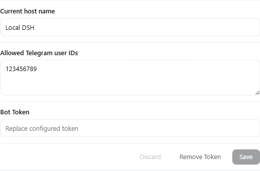
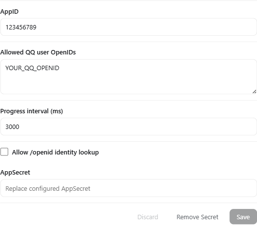
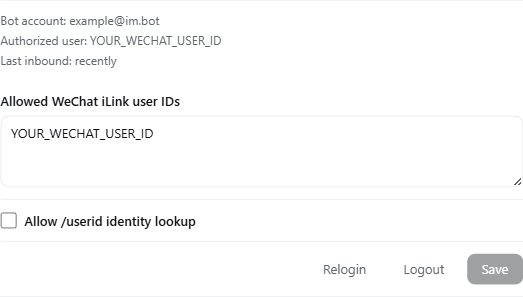

# DSH Channel Telegram

[English](README.md) | [简体中文](README.zh-CN.md)

`dsh-channel-telegram` 用于把 DeepSeek Harness Host 接入 Telegram 私聊、QQ 官方机器人 C2C 消息以及微信 iLink 私聊。三个渠道共用同一套经过鉴权的 DSH 控制面，用于选择主机、项目和会话。

`0.4.2` 版本包含：

- Telegram 内联菜单、进度消息编辑以及图片/文本文件入站。
- QQ 原生 C2C 按钮、交互回调以及数字文本回退菜单。
- 基于腾讯 MIT 许可的 `@tencent-weixin/openclaw-weixin@2.4.6` transport 适配的独立 DSH 微信实现，支持图片和文本文件入站。
- 中文渐进式菜单：只有选择上一级目标后才显示下一级按钮。
- 独立的“状态”按钮，用于查看当前主机、项目、会话和会话状态。

## 环境要求

- Node.js 22 或更高版本。
- 推荐 DeepSeek Harness `0.1.1-rc.1` 或更高版本。微信 Web 扫码控制依赖 `@deepseek-ai/dsh-client-connection >=0.1.1-rc.1`。
- 至少准备一个渠道账号：
  - Telegram Bot Token。
  - QQ 官方机器人 AppID 和 AppSecret。
  - 能够完成 iLink 扫码授权的微信账号。

## 安装或升级

将已发布的 Host 插件安装到 `web` Profile：

```bash
dsh plugin --profile web add dsh-channel-telegram@0.4.2
```

安装后重启当前 DSH Web Host 或桌面端，然后进入“设置 → 插件”配置各个渠道。升级时用相同命令安装目标固定版本，重启 DSH，并在插件列表中确认版本。凭据仍保存在 DSH Credential Storage 中，不会写入仓库或 composition 配置。

已发布的软件包：

| 软件包 | 版本 | 用途 |
| --- | --- | --- |
| `dsh-channel-telegram` | `0.4.2` | DSH Host 插件和 Web 设置卡 |
| `@wsxcant/dsh-channel-telegram-gateway` | `0.3.1` | 共享菜单、路由和会话转发 |
| `@wsxcant/dsh-channel-qq` | `0.2.1` | QQ 官方机器人 C2C transport |
| `@wsxcant/dsh-channel-wechat` | `0.1.1` | 微信 iLink 私聊 transport |

## 在 DSH Web 中配置

以下截图来自真实 DSH 设置界面。账号 ID 均已替换为示例值，密钥输入框保持为空。

### Telegram



1. 通过 BotFather 创建机器人并复制 Bot Token。
2. 添加允许控制 DSH 的 Telegram 数字用户 ID。
3. 设置目标菜单中显示的主机名称。
4. 粘贴 Bot Token 并点击“Save”。

只有同时配置 Bot Token 和至少一个允许的用户 ID 后，Telegram 才会启动。Token 通过只写 DSH CredentialRef `TELEGRAM_BOT_TOKEN` 保存；保存后浏览器无法读取原值。

### QQ 官方机器人



1. 创建或选择 QQ 官方机器人，复制 AppID 和 AppSecret。
2. 在 QQ 设置卡中填写 AppID 和 AppSecret。
3. 如果不知道发送者 OpenID，临时启用“Allow `/openid` identity lookup”。
4. 在 C2C 会话中向机器人发送 `/openid`。
5. 将返回的事件 OpenID 添加到“Allowed QQ user OpenIDs”。
6. 再次关闭 identity lookup 并保存。

普通 QQ 号不是 OpenID。只有 AppID、AppSecret 和至少一个允许的 OpenID 均可用时 QQ 渠道才会启动。AppSecret 保存到 `QQ_BOT_APP_SECRET`。进度间隔允许范围为 `1000`–`60000` 毫秒。

QQ 会优先发送原生 C2C 按钮；如果 QQ API 拒绝 keyboard，请求会自动回退为功能相同的数字文本菜单。

### 微信 iLink



1. 展开微信设置卡并开始扫码登录。
2. 使用微信客户端扫码确认，等待状态变成“Online”。
3. 如果不知道 iLink 用户 ID，临时启用“Allow `/userid` identity lookup”。
4. 在微信私聊中发送 `/userid`。
5. 将返回的 ID 添加到“Allowed WeChat iLink user IDs”。
6. 关闭 identity lookup 并保存。

二维码凭据、cursor、context token 和 typing 状态会序列化到固定的只写 DSH CredentialRef `DSH_CHANNEL_TELEGRAM_WECHAT_ILINK`。原始二维码 URL、验证码和 Token 不会写入普通设置，也不会以明文返回浏览器。

微信目前使用数字文本菜单，因为 iLink 私聊没有提供本插件在 QQ 中使用的原生 keyboard。Telegram 和微信每条消息可接收一张图片或一个 TXT/CSV/JSON/Markdown 文本文件。QQ 媒体事件以及 PDF、压缩包、Office 文件等其他二进制附件暂不支持。

## Composition 默认配置

推荐使用 Web 设置页。插件内置的 composition patch 只提供以下非敏感默认值：

```yaml
- name: dsh-channel-telegram
  config:
    allowedUserIds: []
    hostName: Local DSH
    turnTimeoutMs: 600000
    progressEditIntervalMs: 1000
    diagnosticLogging: false
    qqAppId: ""
    qqAllowedOpenIds: []
    qqProgressIntervalMs: 3000
    qqOpenIdLookupEnabled: false
    wechatAllowedUserIds: []
    wechatIdentityLookupEnabled: false
```

| 配置项 | 含义 |
| --- | --- |
| `allowedUserIds` | Telegram 数字用户 ID allowlist |
| `hostName` | 所有渠道菜单中显示的主机名称 |
| `turnTimeoutMs` | 单次 DSH turn 最大持续时间 |
| `progressEditIntervalMs` | Telegram 进度消息编辑节流时间 |
| `diagnosticLogging` | 临时启用仅含元数据的 Telegram 诊断日志 |
| `qqAppId` | QQ 官方机器人 AppID |
| `qqAllowedOpenIds` | QQ C2C 发送者 OpenID allowlist |
| `qqProgressIntervalMs` | QQ 阶段消息间隔，范围 `1000`–`60000` 毫秒 |
| `qqOpenIdLookupEnabled` | 只允许未授权用户执行 `/openid` 查询 |
| `wechatAllowedUserIds` | 微信 iLink 用户 ID allowlist |
| `wechatIdentityLookupEnabled` | 只允许未授权用户执行 `/userid` 查询 |

不要把 Telegram Bot Token、QQ AppSecret、微信凭据、原始二维码 URL 或验证码写入该 YAML。

## 使用共享菜单

在支持的私聊或 C2C 会话中发送 `/start` 或 `/menu`。

菜单会根据当前选择逐级显示：

| 当前选择 | 可用操作 |
| --- | --- |
| 未选择主机 | `主机`、`状态`、`刷新` |
| 已选择主机 | 增加 `项目` |
| 已选择项目 | 增加 `会话` 和 `新建会话` |

点击“新建会话”后选择 Agent 预设。“状态”视图会显示当前主机、项目、会话和会话状态，并提供“返回”和“刷新”。

仍然可以使用文本命令：

```text
/start       打开菜单
/menu        打开菜单
/computers   选择主机（为兼容旧版本保留原命令名）
/projects    选择项目
/sessions    选择会话
/new         使用 Agent 预设创建会话
/status      查看当前选择和状态
/stop        停止当前 turn，同时保留排队中的工作
```

## 渠道能力

| 能力 | Telegram | QQ | 微信 |
| --- | --- | --- | --- |
| 私聊/C2C 文本 | 支持 | 支持 | 支持 |
| 入站图片 | 支持 | 不支持 | 支持 |
| 入站文本文件（TXT/CSV/JSON/MD） | 支持 | 不支持 | 支持 |
| 其他二进制附件 | 不支持 | 不支持 | 不支持 |
| 原生按钮 | Inline keyboard | C2C keyboard | 不支持，使用数字菜单 |
| 数字文本回退 | 支持 | 支持 | 支持 |
| allowlist 身份 | 数字用户 ID | 事件 OpenID | iLink 用户 ID |
| 身份初始化 | 外部获取数字 ID | `/openid` | `/userid` |
| 进度展示 | 编辑同一条消息 | 节流发送阶段消息 | typing + 一个过程节点 |
| 已选会话转发 | 支持 | 支持 | 支持 |

只有 allowlist 中的用户能够进入 DSH 控制面。回调 Token 使用不透明值，并绑定具体用户和会话；Token 只能使用一次且会自动过期。所选会话忙碌时，新消息会作为 FIFO 的下一轮 follow-up 被接受，不会中断当前 turn；Telegram、QQ 和微信会立即显示“已加入队列”，轮到后再开始新 turn。`/stop` 仍立即执行，并保留已排队的 inbox。

## 故障排查

- **渠道一直未启动：** 确认该渠道的凭据存在，并且 allowlist 非空。
- **QQ 只显示数字文本：** QQ API 拒绝了原生 keyboard；数字菜单仍可完整使用。
- **QQ 按钮无反馈：** 确认机器人订阅 `INTERACTION_CREATE` 和 C2C 消息 intents，然后重新发送 `/menu`，因为回调 Token 只能使用一次。
- **微信显示 Online 但收不到消息：** 重新登录后发送一条私聊文本。腾讯也在 [openclaw-weixin issue #244](https://github.com/Tencent/openclaw-weixin/issues/244) 中记录过 HTTP 200 但 `msgs` 持续为空的账号。
- **菜单已过期：** 重新发送 `/menu`。
- **目标选择错误：** 打开“状态”，再依次选择主机、项目和会话。

只在排查问题期间启用 `diagnosticLogging`。它只记录路由元数据，不记录消息正文、回调数据、凭据、项目 ID 或会话 ID。

## 开发与验证

```bash
pnpm install
pnpm check
```

`pnpm check` 会构建、类型检查并测试所有 workspace 软件包。自动化测试使用假的 Telegram、QQ、微信、HTTP 和 Gateway 对端；真实账号验证仍是独立的验收步骤。

## 安全与范围

- 禁止提交 `.env`、`.npmrc`、Access Token、Bot Token、AppSecret、二维码内容、验证码、OpenID 或 iLink 用户 ID。
- 同一组机器人凭据只能由一个正在运行的插件实例持有。
- Telegram 和 QQ 凭据为只写存储；微信会话资料保存在一个只写 CredentialRef 中。
- 微信 transport 保留腾讯 MIT 许可声明：[`packages/wechat/LICENSE.tencent-openclaw-weixin`](packages/wechat/LICENSE.tencent-openclaw-weixin)。

## 许可证

Workspace 中的软件包均声明为 MIT 许可证。包含腾讯来源代码的微信 transport 还保留了上方链接的上游适配声明。
